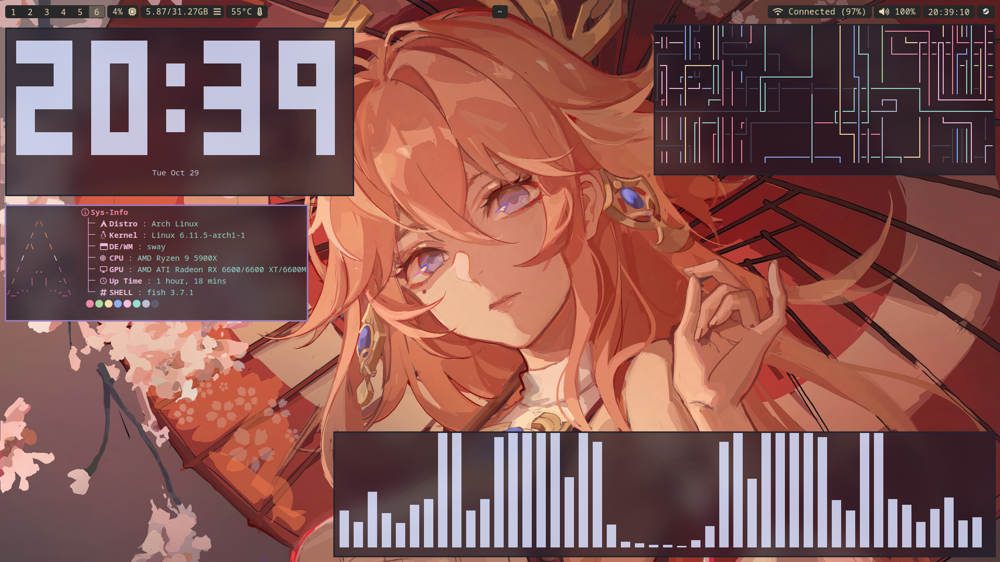

### Salem's minimal dotfiles for SwayFX

### Steps

```
git clone https://github.com/rott1ngC0rpse/swayfx-dotfiles.git
```

```
git clone https://aur.archlinux.org/paru && cd paru && makepkg -si
```

```
paru -S fuzzel waybar hyprlock ttf-jetbrains-mono-nerd swayfx swww starship slurp rose-pine-cursor ranger vim mako autotiling nusehll grim alacritty arc-gtk-theme papirus-icon-theme && rm -rf ~/paru
```

my personal pick (optional)
```
paru -S vesktop pcmanfm-gtk3 mtpfs mullvad-browser bluez bluez-utils fastfetch gvfs gvfs-mtp keepassxc networkmanager steam xdg-user-dirs xorg-xwayland qt6-wayland qt5-wayland noto-fonts-cjk noto-fonts-emoji-noto-fonts-extra
```


