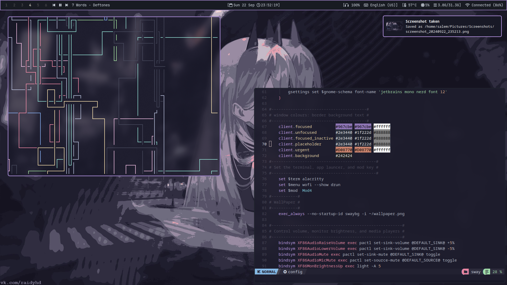
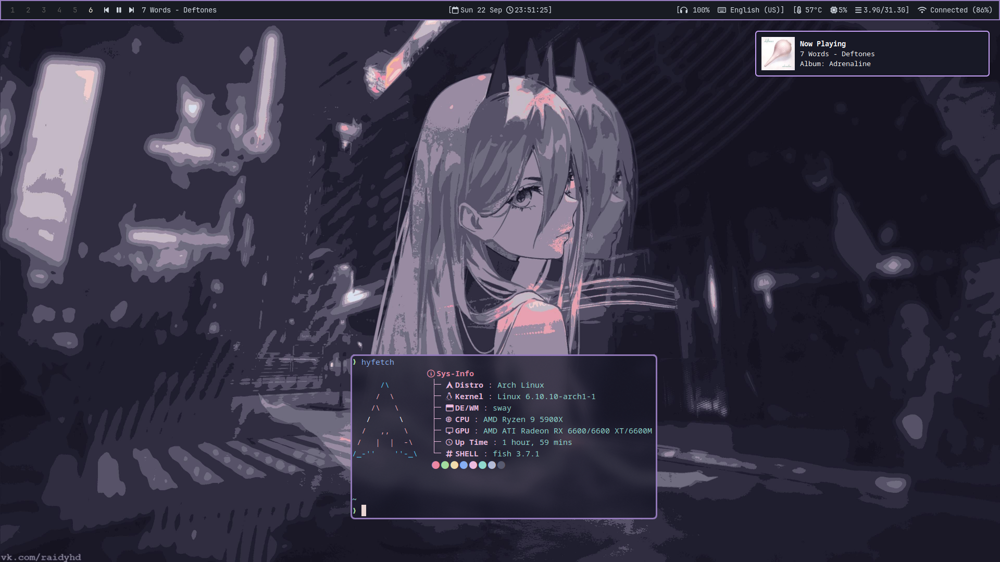
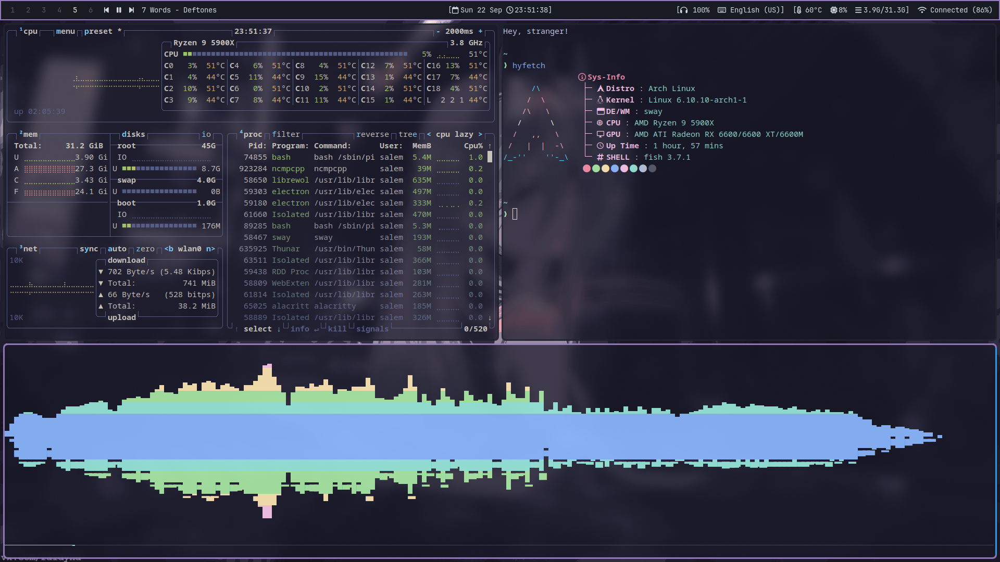
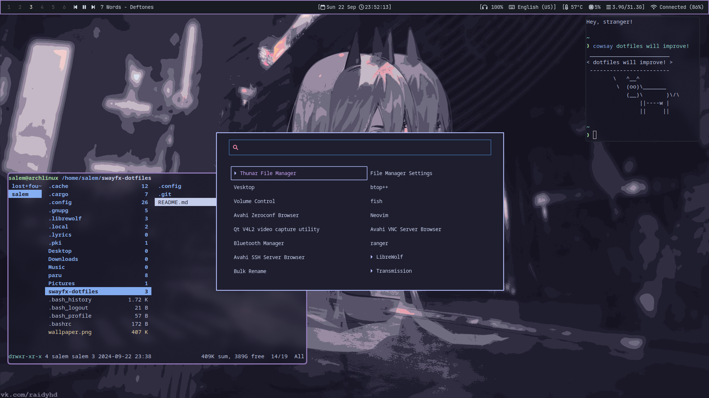

# SwayFX dotfiles

## Key Highlights:
- 💾 **Terminal:** Alacritty
- 🐚 **Shell:** Fish + Starship
- 🌌 **Taskbar:** Waybar
- 🗃️ **File Manager:** Ranger
- ✍️ **Text Editor:** Neovim
- 🚀 **App Launcher:** Wofi

|                          |                          |
|--------------------------|--------------------------|
|  |  |
|  |  |

## Installion:
```
git clone https://github.com/rott1ngc0rpse/swayfx-dotfiles
```

```
mv swayfx-dotfiles/.config/* ~/.config
```

## Packages:
```
sudo pacman -S mako grim ranger alacritty \
tmux fish starship waybar wofi swayimg \
blueman btop pavucontrol networkmanager \
wl-clipboard tlp swaylock neovim pamixer \
noto-fonts-emoji noto-fonts-cjk noto-fonts-extra \
ttf-meslo-nerd ttf-jetbrains-mono libnotify \
swaybg arc-gtk-theme papirus-icon-theme mpd mpc \
ncmpcpp ffmpegthumbnailer slurp ffmpeg libnotify 
```

## Optional packages:
```
sudo pacman -S brightnessctl playerctl mpv hyfetch \
unrar unzip xorg-xwayland ueberzug ly
```

## aur packages:
```
paru -S swayfx autotiling rose-pine-cursor
```

## Troubleshooting:
https://wiki.archlinux.org/title/Sway

